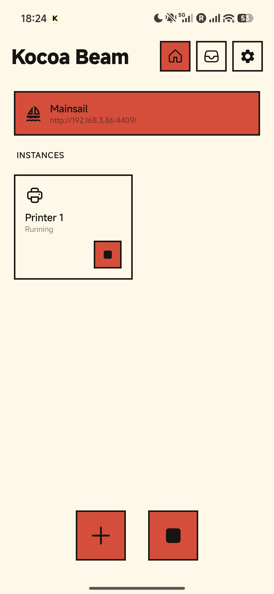
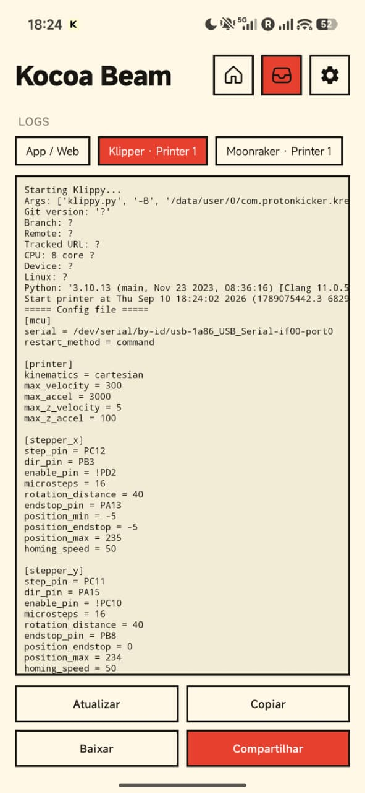

# Update v2

**Languages: [English](whats-new.md) · [Português (BR)](pt-br/whats-new.md) · [简体中文](zh-Hans/whats-new.md)**

This page summarises what this project changes on top of the base application, for
both end users and developers. For firmware, see
[build-firmware.md](build-firmware.md); for the optional Klipper add-ons, see
[mods/klipper-addons.md](mods/klipper-addons.md).

## Bundled software

The print stack is updated to recent upstream releases. The exact versions are
pinned in the build (`gradle.properties` and `app/build.gradle`):

| Component | Version bundled |
|---|---|
| Klipper host | current upstream (MCU firmware target: **0.13**) |
| Kalico host | current upstream |
| Moonraker | **0.11.0** (Web API 1.5.0) |
| Fluidd | **1.37.5** |
| Mainsail | **2.19.0** |
| Happy Hare (MMU) | **v4.0.0** |
| Moonraker-timelapse | bundled |

Static assets for Fluidd and Mainsail are served with correct MIME types, so both
front ends load fully styled and saving files or configs from the web UI works.

  
  

## Web interface ports

Each front end has its own port instead of a shared one:

| Front end | URL |
|---|---|
| Fluidd | `http://<device-ip>:4408/` |
| Mainsail | `http://<device-ip>:4409/` |

The port follows the front-end toggle on the main screen, which also shows the
active URL. Camera endpoints remain on `:8889`.

## In-app log viewer

A **Logs** tab exposes the Klipper, Moonraker and application logs. Each can be
viewed, copied, downloaded to the device's `Downloads/` folder, or shared — no
PC or `adb` required.

## G-code metadata and thumbnails

This did not work before and has been fixed. Uploaded jobs now display their
preview image, print time, filament usage and object list in Fluidd/Mainsail.
Moonraker normally extracts this by launching a separate helper process, which is
not possible inside an Android application; the extraction was changed to run
in-process.

## Starting printer.cfg template

A `printer.cfg` template is provided with a macro pack covering `PRINT_START` /
`PRINT_END`, adaptive bed mesh, pressure-advance and speed calibration,
babystepping, filament load/unload and preheats.

## Bundled Klipper add-ons (opt-in)

Vendored but inactive until the matching section is added to `printer.cfg`:
KAMP, LED Effect, Z Calibration, Auto Speed, TMC Autotune. See
[mods/klipper-addons.md](mods/klipper-addons.md). A procedure for tuning input
shaper without an accelerometer is in
[mods/input-shaper-manual.md](mods/input-shaper-manual.md).

## Crash log

On an unexpected exit the application writes `last_crash.txt` for later
inspection.

## MCU firmware

Build tooling for any supported board is documented in
[build-firmware.md](build-firmware.md).

## Not tested

The camera extension (`[beam_camera]` — flashlight and autofocus control) is
carried over unchanged and has not been tested in this project.
